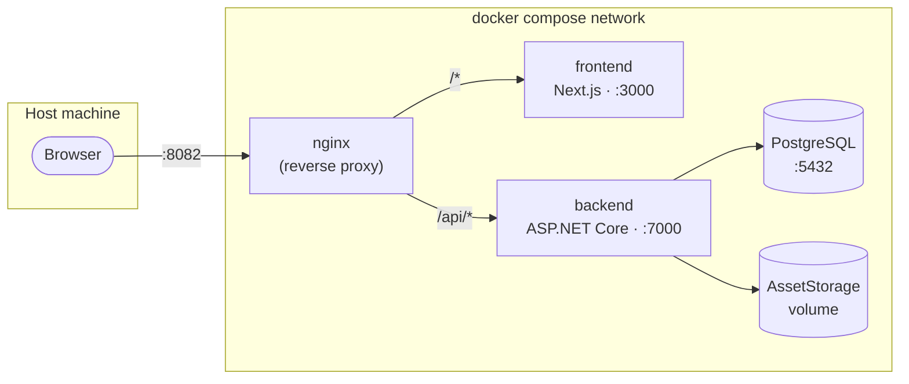

# WikiSelf

A self-hosted, permission-aware documentation wiki. Organize documents in nested folders, control access per folder/document through groups, and export content as PDF, Markdown, or Word — all from a single Docker Compose stack you run on your own server.

[](https://nextjs.org)
[](https://dotnet.microsoft.com)
[](https://www.postgresql.org)
[](https://docs.docker.com/compose/)

## Contents

- [Features](#features)
- [Tech stack](#tech-stack)
- [Architecture](#architecture)
- [Project structure](#project-structure)
- [Quick start (Docker)](#quick-start-docker)
- [Local development](#local-development)
- [Configuration](#configuration)
- [Scripts reference](#scripts-reference)
- [Deployment notes](#deployment-notes)

## Features

**Documents & folders**
- Nested folder tree with drag-free move/rename/delete and per-node context menus
- Rich text editor (Tiptap) with images, code blocks, tables, links, and version history
- Tags and categories, with category-based browsing from the sidebar
- Full-text search (PostgreSQL) that only ever returns documents you're permitted to see

**Access control**
- Users, groups, and per-folder/per-document permission levels (View / Edit / Manage)
- Permissions are enforced end-to-end — including in search and category browsing, not just direct navigation
- JWT access + refresh token authentication

**Export**
- Per-document export to PDF, Markdown, or Word (`.docx`, with embedded images)
- "Export all" — every folder and document, mirrored as a real folder structure inside a single `.zip`, gated behind a password re-check

**Admin**
- First-run setup wizard
- User & group management, permission editor, audit log
- Site branding (logo, favicon, title, meta description, fonts)

## Tech stack

| Layer | Technology |
| --- | --- |
| Frontend | Next.js 16 (App Router, Turbopack), React 19, TypeScript, Tailwind CSS v4, TanStack Query, Tiptap, Framer Motion |
| Backend | ASP.NET Core 10, Entity Framework Core, JWT Bearer auth, FluentValidation, BCrypt |
| Database | PostgreSQL 16 (incl. full-text search) |
| Infra | Docker, Docker Compose, nginx |

## Architecture

The whole stack sits behind a single nginx entrypoint. Nothing else is exposed to the host — the frontend and backend only talk to each other over the internal Docker network, and the app is designed to be reached by IP/hostname on one port rather than a fixed domain.



## Project structure

```
wiki-self/
├── backend/                 # ASP.NET Core Web API
│   ├── src/WikiSelf/
│   │   ├── Controllers/      # REST endpoints
│   │   ├── Services/         # Business logic (folders, documents, auth, permissions, search…)
│   │   ├── Entities/         # EF Core entities
│   │   ├── Migrations/       # EF Core migrations
│   │   └── Authorization/    # Resource-based permission handlers
│   └── Dockerfile
├── frontend/                 # Next.js app
│   ├── app/                  # App Router routes
│   ├── components/           # UI, organized by feature
│   ├── lib/                  # API clients, auth, export renderers, hooks
│   └── Dockerfile
├── nginx/                     # Reverse proxy config + Dockerfile
├── docker-compose.yml
└── .env.example
```

## Quick start (Docker)

This is the recommended way to run WikiSelf — it builds and wires up nginx, the frontend, the backend, and PostgreSQL in one command.

**Prerequisites:** Docker and Docker Compose.

```bash
git clone <this-repo-url> wiki-self
cd wiki-self

cp .env.example .env
# edit .env — at minimum, change POSTGRES_PASSWORD and JWT_SECRET

docker compose up -d --build
```

Once the containers are healthy, open **http://localhost:8082** (or `http://<your-server-ip>:8082`) and complete the first-run setup wizard.

Useful commands:

```bash
docker compose logs -f            # tail logs from every service
docker compose down               # stop everything (keeps volumes)
docker compose down -v            # stop everything and wipe the database/asset volumes
```

Data persists in two named volumes: `db_data` (PostgreSQL) and `backend_assets` (uploaded images/attachments).

## Local development

For day-to-day development it's usually faster to run the frontend and backend directly instead of rebuilding containers.

**Prerequisites:** .NET 10 SDK, Node.js 22+, PostgreSQL 16 running locally.

### Backend

```bash
cd backend/src/WikiSelf

# Point ConnectionStrings:DefaultConnection (appsettings.json / user-secrets) at your local Postgres
dotnet run
```

The API listens on `http://localhost:7000` and applies EF Core migrations automatically on startup. Swagger UI is available at `http://localhost:7000/swagger` while `ASPNETCORE_ENVIRONMENT=Development`.

### Frontend

```bash
cd frontend
npm install

# .env.local
echo "NEXT_PUBLIC_API_URL=http://localhost:7000" > .env.local

npm run dev
```

The app runs on `http://localhost:3000` and talks directly to the backend on port 7000 (no nginx in front of it during local dev).

## Configuration

### `.env` (Docker Compose)

| Variable | Default | Description |
| --- | --- | --- |
| `POSTGRES_DB` | `wikiself` | Database name |
| `POSTGRES_USER` | `postgres` | Database user |
| `POSTGRES_PASSWORD` | `postgrespw` | Database password — **change this** |
| `JWT_SECRET` | *(dev key baked into the repo)* | Base64 symmetric key signing JWTs — **change this**; generate one with `openssl rand -base64 64` |
| `PUBLIC_ORIGIN` | `http://localhost:8082` | Origin the app is served from; only used for the backend's CORS allow-list |

### Backend (`appsettings.json`)

Key settings, all overridable via environment variables (double-underscore syntax, e.g. `Jwt__Secret`):

| Key | Purpose |
| --- | --- |
| `ConnectionStrings:DefaultConnection` | PostgreSQL connection string |
| `Jwt:Secret` / `Issuer` / `Audience` | JWT signing configuration |
| `Jwt:AccessTokenExpirationMinutes` / `RefreshTokenExpirationDays` | Token lifetimes |
| `AssetStorage:RootPath` | Where uploaded files are written on disk |
| `Cors:AllowedOrigins` | Allowed origins for direct (non-proxied) API access |

### Frontend

| Variable | When it's read | Purpose |
| --- | --- | --- |
| `NEXT_PUBLIC_API_URL` | Build time | Base URL the browser calls. Left empty in the Docker build so requests stay same-origin through nginx; set to `http://localhost:7000` for local dev. |

## Scripts reference

**Frontend** (`frontend/package.json`)

| Script | Description |
| --- | --- |
| `npm run dev` | Start the Next.js dev server |
| `npm run build` | Production build (Turbopack) |
| `npm run start` | Serve a production build |
| `npm run lint` | Run ESLint |

**Backend**

| Command | Description |
| --- | --- |
| `dotnet run` | Run the API (applies migrations on startup) |
| `dotnet build` | Build only |
| `dotnet ef migrations add <Name>` | Add a new EF Core migration (run from `backend/src/WikiSelf`) |

## Deployment notes

- This project is built to run on a **single local/internal server without a domain** — it's addressed by IP and one published port, not a hostname.
- **Only nginx is published to the host**, on `0.0.0.0:8082`. The frontend (3000) and backend (7000) are only reachable inside the Docker network.
- The frontend is built with a relative `NEXT_PUBLIC_API_URL`, so the browser always calls the API same-origin through nginx — no CORS setup or hardcoded host is required even if the server's IP changes.
- Back up the `db_data` and `backend_assets` volumes to preserve documents and uploaded files.
